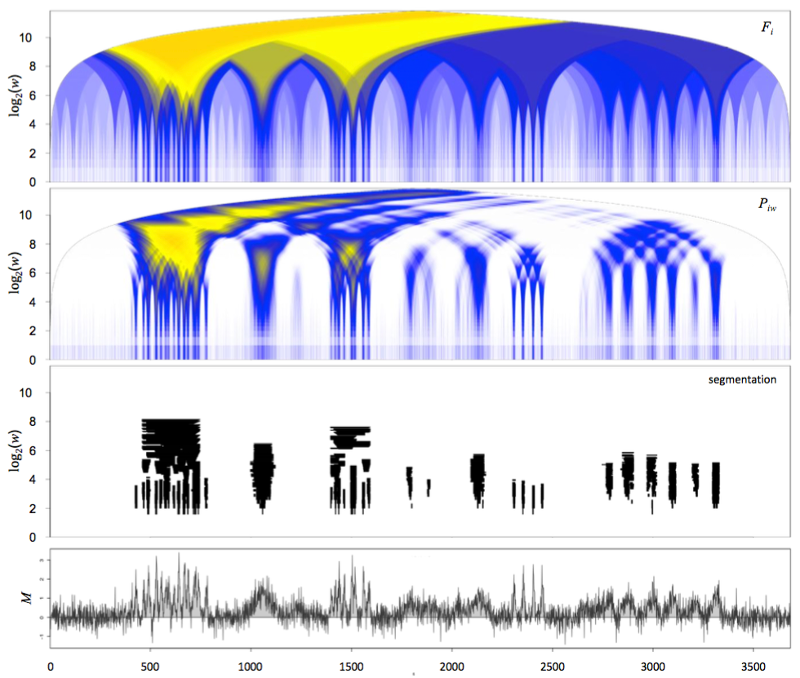

MRA.TA - Multi-Resolution Analysis of Tiling Arrays
================================================================================

### Overview ###

`MRA.TA` is an R package for multi-resolution representation and segmentation of
genomic profiles from
[tiling arrays](https://en.wikipedia.org/wiki/Tiling_array).

This package can be used to detect enriched regions of arbitrary size from
Chromosome Conformation Capture on Chip (4C) data, the microarray version of 4C
employed in early genomic studies of chromosome conformations, as well as
from Chromatin Immuno-Precipitation on chip (ChIP-on-chip), the precursor of
the ChIP-seq technique.

`MRA.TA` provides a set of normalization, assignment of probes to restriction
fragments and probe filtering functions dedicated to 4C data[<sup>1</sup>](#1),
as well as multi-resolution analysis methods that are relevant for both 4C
and ChIP-on-chip profiles.



The example above shows a multi-resolution analysis, with the domaingram
representation[<sup>2</sup>](#2) (panel **_Piw_**) and the corresponding
multi-resolution segmentation (panel **_segmentation_**), from simulated data
(bottom panel, **_M_**).
Segmentations computed with `MRA.TA` are based on an algorithm tracing
locally optimal enrichment statistics (top panel **_Fi_**).
This algorithm produces raw segmentation trees which are then refined and
simplified using rules of internal consistency
(automated post-processing).

For further details and examples with real 4C data see
[Leblanc _et al_. 2016](#1) and the associated
[MiMB.4C](https://github.com/benja0x40/MiMB.4C) workflow.

### Package installation ###

#### Installation from github ####

Run the R code below to install `MRA.TA`.

```R
library("devtools")
install_github("benja0x40/MRA.TA")
```

If the installation fails, try to install dependencies manually as follows.

#### Dependencies ####

  - [R environment](https://www.r-project.org/) version 3.x
  - CRAN packages `devtools`, `stringr`, `getopt`, `plotrix`
  - [Bioconductor](http://www.bioconductor.org/) packages
    `Biostrings`, `GenomicRanges`
  
Run the R code below to install CRAN and Bioconductor package dependencies
for `MRA.TA`.

```R
# Already installed
pkg <- installed.packages()[, "Package"]

# CRAN packages
lst <- c("devtools", "stringr", "getopt", "plotrix")
lst <- setdiff(lst, pkg)
if(length(lst) > 0) install.packages(lst, repos = "https://cloud.r-project.org/")

# Bioconductor packages
lst <- c("Biostrings", "GenomicRanges")
lst <- setdiff(lst, pkg)
if(length(lst) > 0) {
  source("https://bioconductor.org/biocLite.R")
  biocLite(lst)
}
```

### Acknowledgements ###

Thanks to Elzo de Wit for kindly sharing his source code and suggestions on the
multi-resolution methods, and to Bas Tolhuis who greatly helped with Nimblegen
tiling array data analyses, also sharing source code as well as unpublished
biological data. Thanks to Jean-Philippe Villemin for testing the installation and execution of
the associated [MiMB.4C](https://github.com/benja0x40/MiMB.4C) workflow and
reporting issues and suggestions.

### References ###

<a name="1"></a>1. Leblanc B., Comet I., Bantignies F., and Cavalli G., *Chromosome Conformation Capture on Chip (4C): data processing.* Book chapter in *Polycomb Group Proteins: Methods and Protocols.* Lanzuolo C., Bodega B. editors, Methods in Molecular Biology (2016).  
[publisher](http://dx.doi.org/10.1007/978-1-4939-6380-5_21) | [pubmed](https://www.ncbi.nlm.nih.gov/pubmed/27659990)

<a name="2"></a>2. de Wit E., Braunschweig U., Greil F., Bussemaker H. J. & van Steensel B. *Global chromatin domain organization of the Drosophila genome.* PLoS Genetics (2008).  
[publisher](http://dx.doi.org/10.1371/journal.pgen.1000045) | [pubmed](https://www.ncbi.nlm.nih.gov/pubmed/18369463)
